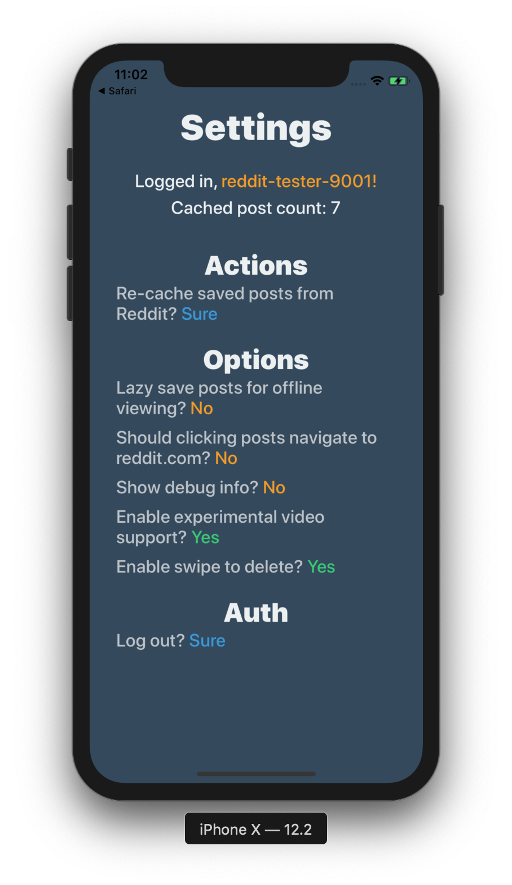

# Shuffler
Randomly shuffle saved comments/posts from Reddit

</img>
</img>
</img>
</img>

# Features

* Offline post cache
    * Caching more than 1000 (reddit's maximum) post count
* Offline image cache
    * Unlimited size
* Uncaching, deleting posts (unsaving from reddit)
* Experimental video post support
* Blazing fast render speed

# Instructions

To simulate locally: `react-native run-ios --simulator="iPhone X"`

To run on device, open the XCode project, enable signing, plug in device, run `react-native run-ios --device --configuration=release`

Release to the App Store planned in the future
